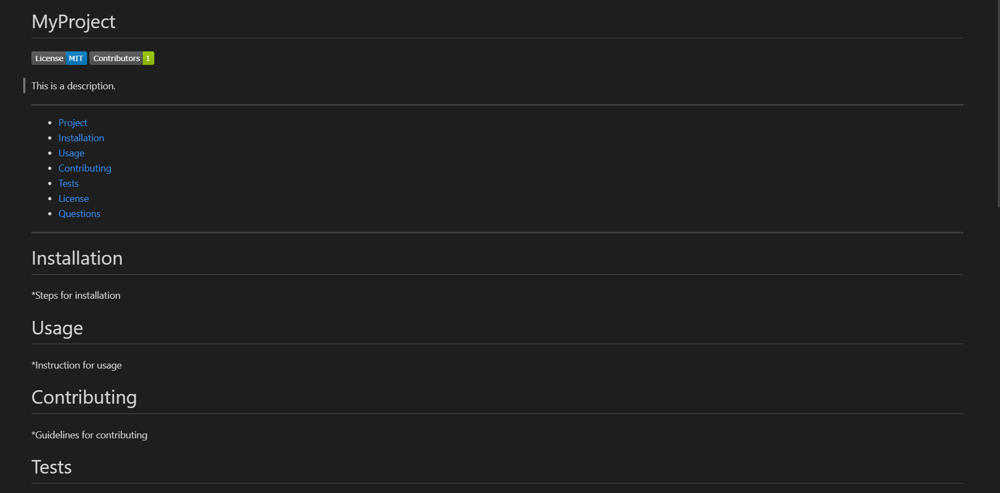

# ReadMeGenerator

In this repository I created an application using Node.js that generates a README.md file. The user is prompted with a series of questions to determine the content of the README, and then the file is generated with badges and contact info of the GitHub profile provided.

